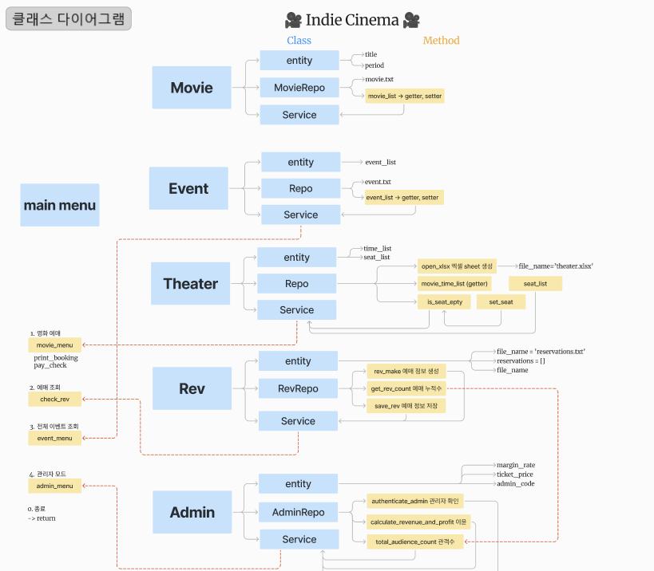

# DA36-miniproject1

# 🍿IndieCinema🍿
***
IndieCinema는 독립영화관 영화 현장 예매 키오스크 콘솔 프로그램입니다.
<br>

시네필들을 위한 상영 · 영화 이벤트 정보를 제공합니다

<br>


## 🎥 인디시네마에서는 이런 걸 할 수 있어요!
***
### 1. 영화 예매

- 당일 매칭된 영화와 상영 시간 스케쥴을 확인 후 상영 시간을 번호로 선택
- 선택한 영화에 따른 이벤트 정보 확인
- 좌석을 (n,m) 형태로 입력하여 좌석 선택 
- 결제 진행 여부 최종 확인 후 예매 내역 출력

### 2. 예매 내역 조회

- 예매 후 부여받은 예매 번호 입력시 예매 내역 출력

### 3. 전체 이벤트 조회

- 상영관에서 진행 중인 모든 이벤트 확인

### 4. 관리자 모드

- 올바른 관리자 코드 입력시 관리자 모드 전환
- 총 매출과 이윤 확인 
- 누적 관객수 확인

<br>

## 🎥 인디시네마의 시연영상 함께 보실까요?
###### 해당 팀원의 youtube 채널로 이동합니다. 영상 내용은 동일합니다.

[](https://youtu.be/b5c93B7LmgE?si=qccVx5oWY42ytTdv)

[김정아의 채널에서 보기](https://youtu.be/OA49HNgpa_E?si=nUdQBPnGgQJdxZme)
<br>
[심정석의 채널에서 보기](https://www.youtube.com/watch?v=C9HAoDm_--M)
<br>
[조한희의 채널에서 보기](https://youtu.be/b5c93B7LmgE?si=PV0pb73ppMglAS-9)
<br>
[허채연의 채널에서 보기](https://youtu.be/e6QbKj5W4f8?si=5ByYNl8veqf3mCNh)


<br>

## ⚙️ 인디시네마는 이런 기술을 사용했어요!
***

- Python
- Excel file
- Text file
- Figma
- Github

<br>


## 🏠 인디시네마의 클래스 구조
*** 

* main_menu.py 
  * user가 kiosk에서 입력하는 값을 받음
  * 입력하는 값에 따른 return 값을 출력해주는 일을 담당

---
* Entity
  * 실제 자료의 구조 (객체)
  

* Service
  * 사용자가 입력한 값에 대한 return 값을 요청하는 역할


* Repo (repositoriy)
  * 정보의 저장소
---
## class
###### ㄴ 각 class는 entity, repo, service file을 가집니다.

1) **movie**
- movie.txt 파일에 현재 영화관에서 상영중인 영화 목록 관리

2) **theater**
- theater.xlsx 파일에 날짜별 worksheet 생성 이후에 상영정보 (영화제목/시간/좌석) 저장

  - python에서 excel 접근  
  - ```pip install openpyxl```
  - ```import openpyxl```  

3) **rev (reservation)**
- reservation.txt 파일에 예매 정보를 저장합니다
  - 형식 : 예매번호(rev_id),영화제목,상영시간, 좌석(행), 좌석(열)


4) **event**
- event.txt 파일에 영화별 event 내용 저장
  - 형식 : (영화 내용, 진행하는 이벤트 내용, 이벤트 진행 기간 )


5) **admin**
- 관리자
  1) 매출 확인
  2) 총 관객 수 확인


</img>

  

<br>

## 💭 인디시네마 팀원들의 소감 들어볼까요?
***
### 🟤허채연 (team lead)

- 짧은 시간 내에 프로젝트를 완수해야 했던 상황에서, 각기 다른 실력을 가진 팀원들에게 업무를 효과적으로 분배하는 데 도전이 있었습니다.

- 여러 명의 팀원과 협업하는 프로젝트를 진행하면서 기록과 소통의 중요성을 깨달았고, GitHub 이슈 관리가 부족하여 진행 상황을 명확히 기록하지 못한 점이 프로젝트의 아쉬운 점입니다.

- Event class의 구현 여부는 진행상황을 보고 결정하기로 하였었는데, 팀원분들의 열정적인 참여 덕에 구현해낼 수 있었습니다.
 


### 🟣김정아 

첫 프로젝트가 시작되었을 때 막연하다라는 생각이 먼저 들었으나 프로젝트가 끝난 지금 다같이 코드를 작성한 것이 실행되었다는게 신기했다.
프로젝트를 진행하면서 다시 한번 나의 실력을 뒤돌아 볼 수 있는 기간이 되었고, 막혔던 부분은 팀원들과 풀어가면서 다시 한번 이해할 수 있었고, 서로 오류난 부분을 의논하고 고치며 파일을 주고 받는 과정, 파일을 구분지어놓는 방법 등 진행과정도 함께  배우게 되어
유익한 시간이었다.

그럼에도 부족한 부분이 많기에 기초풀이, 응용풀이들을 더 연습하여 막히는 부분이 적도록 연습을 해야겠다는 다짐도 하게되었다.
프로젝트하느라 팀원분들 모두모두 고생많으셨습니🥰

### 🟡심정석

[아직은 갈 길이 멀다...] 

이번 미니 프로젝트를 하면서 가장 크게 되돌아보게된 부분은 나의 실력이였다. 
복습 부족을 절실하게 느꼈고 영어를 처음 배울때 처럼 단어만 알고 단어 조합을 못해서 자연스럽게 내가 하고픈 말을 못하는 느낌이였다.

파이썬 문법에 대한 이해도가 아직 많이 부족하기 때문에 자연스럽게 여러 문법을 다양하게 다룰수 있게 복습과 문제를 많이 풀어봐야 겠다.

또한 github 에 대한 활용도가 생각보다 높은것을 깨달았고 이후에 취업을 하고 실무적으로도 개인적으로도 유용하게 사용될것 같다.

팀원분들 모두 고생하셨습니다~!! :)

### 🟢조한희
- 객체지향 개념을 학습한 후, 클래스 다이어그램을 그려 구조도를 작성하면서 객체지향 프로그램의 전체 흐름을 이해할 수 있었습니다.
- Github 협업 도구를 사용하여 하나의 파일에서 공동작업하는 방법을 배우는 소중한 기회였습니다. 또 작은 부분도 하나하나 서로 소통하며 이해시키는 과정에서 소통의 중요성을 깨달았습니다.
- 독립영화를 좋아한다는 개인적인 이유로 프로젝트 주제를 제안했는데, 프로젝트를 성공적으로 마무리할 수 있어 매우 뿌듯했습니다. 특히, 프로젝트의 출발점이었던 영화 별 이벤트 조회 기능을 후반부에 추가하면서 클래스를 통한 기능 구현 로직을 더 깊이 이해할 수 있었습니다.

